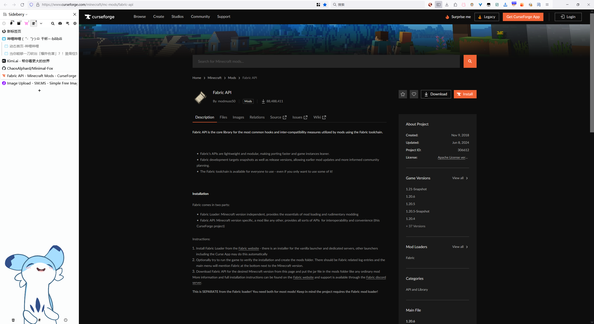
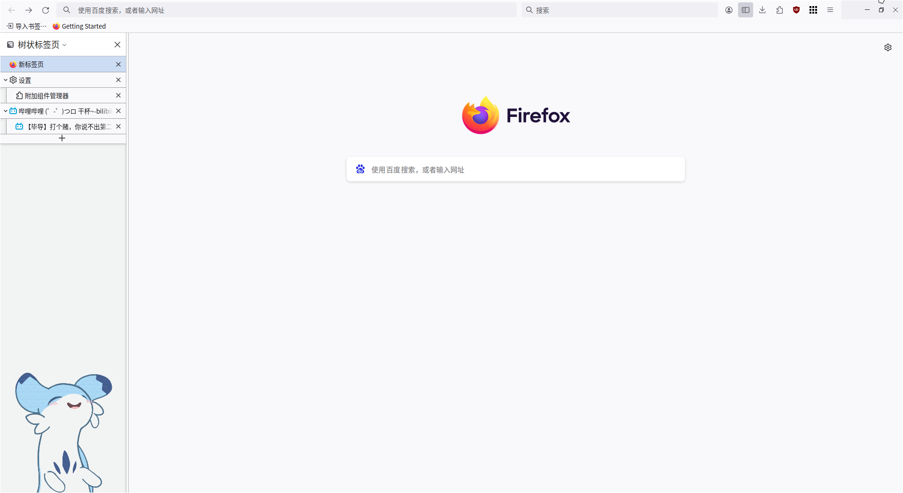
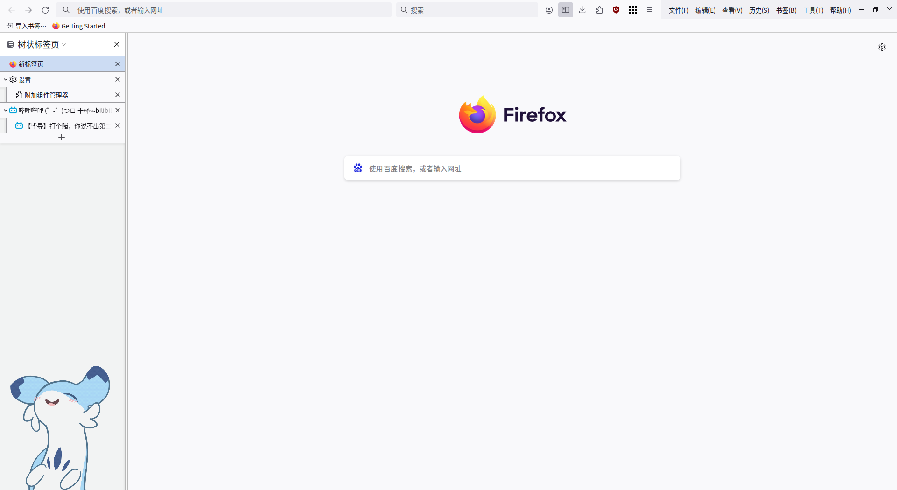
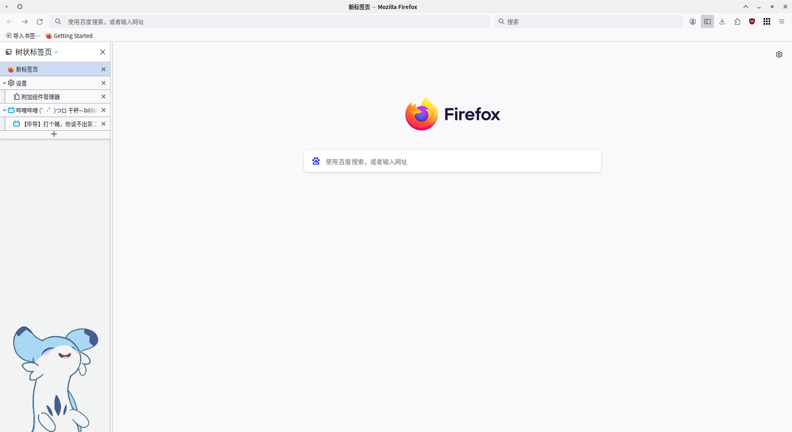

# Minimal-Fox

使用`userChrome.css`自定义`Firefox`浏览器界面，支持`Windows`与`Linux`上的Firefox

## 安装
1. 在地址栏输入`about:config`，进入页面后将`toolkit.legacyUserProfileCustomizations.stylesheets`选项的值改为`true`
2. 在地址栏输入`about:support`，进入页面后找到`配置文件夹`选项，点击`打开文件夹`，或者也可以直接访问`%APPDATA%\Mozilla\Firefox\Profiles\<profile_name>`
3. 在配置文件夹中新建`chrome`文件夹，并将`userChrome.css`文件放入
4. 重启Firefox浏览器

## 侧边标签页插件

该配置会隐藏标签页，建议配置侧边标签页插件使用

[Sidebery](https://addons.mozilla.org/firefox/addon/sidebery)

[TreeStyleTab](https://addons.mozilla.org/firefox/addon/tree-style-tab)